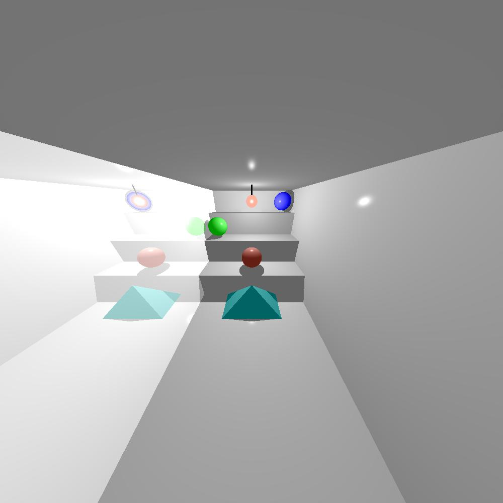
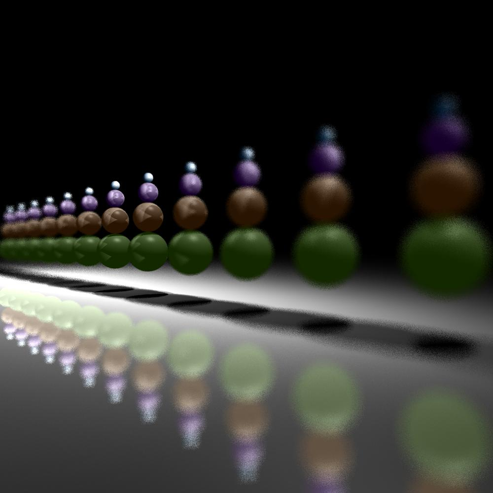

# Raytracer
## Project in Introduction to Software Engineering course at JCT.

The purpose of the project is to model shapes, lighting and shade by using linear algebra with emphasis on design patterns and test writing.

### Examples of images created by the software.

Mirror effect and focus effect

